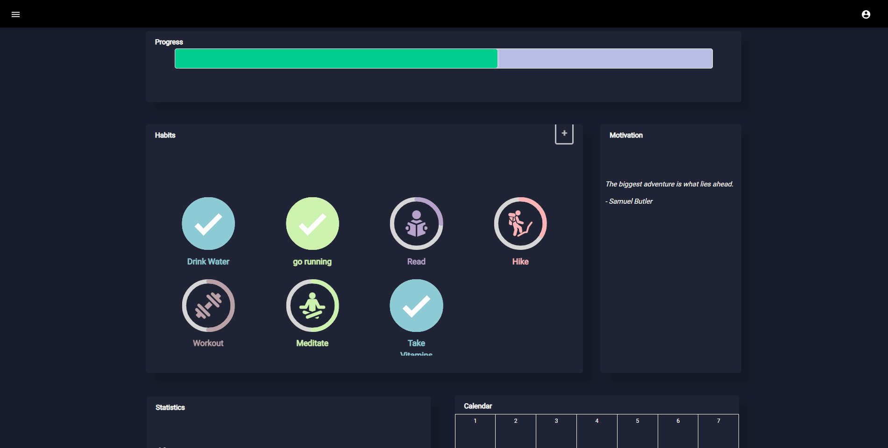
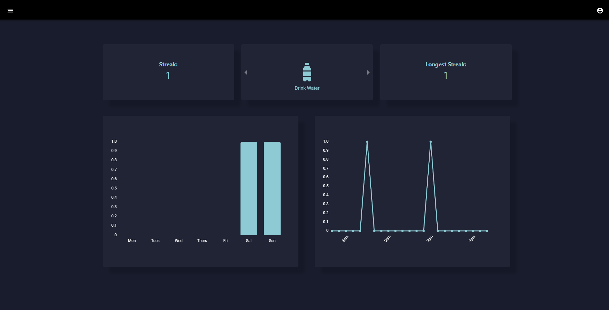
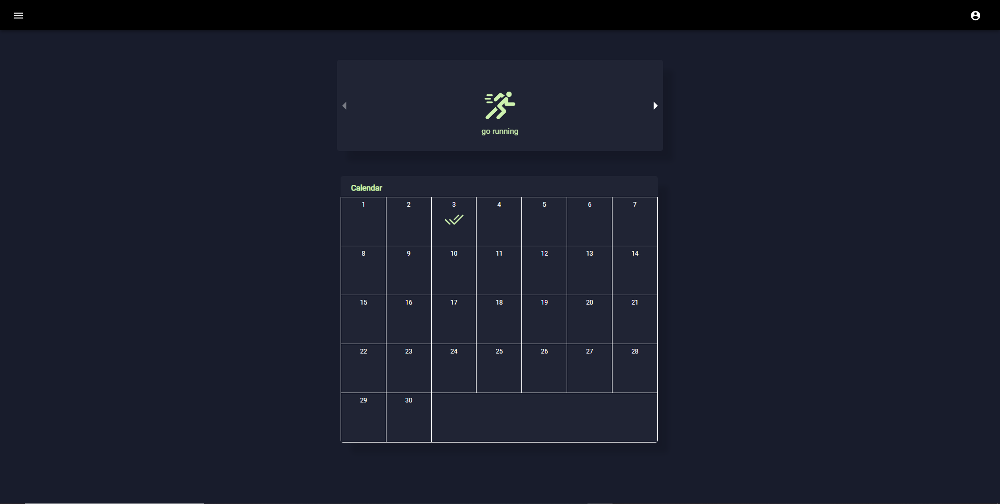

# Person-Habit-tracker
## Table of Contents
* [Introduction](#introduction)
* [Features](#features)
* [Screenshots](#screenshots)
* [Usage](#usage)
* [Project Status](#project-status)

<br/>

## Introduction
- ### Problem
    ```Users want to build habits that can keep them productive and help them reach their ultimate goals in life. It's hard to actually build these habits without keeping track of them.```
- ### Purpose
    ``` The purpose of Habeuro is to give users the ability to track their habit building proccess by keeping track of their streaks, showing their progress, and giving them infomative data.```
- ### Why 
    ```I chose to create Habeuro because I was always interested in becoming more productive. There are a few habit trackers I tried but they didn't have the features I wanted and some were to expensive.```
<!-- You don't have to answer all the questions - just the ones relevant to your project. -->

<br/>


## Features
- Habit customizability: choose which week days users want to compelete habits 
- Progress Tracking: show completion percentage of all habits
- Graphs: week days and time users complete habits the most
- Calendar: which dates habits were completed

<br/>

## Screenshots

<p align="center" width="100%">
    
</p>
<br/>
<br/>
<br/>


<p align="center" width="100%">
    
</p>
<br/>
<br/>
<br/>


<p align="center" width="100%">
    

</p>
<br/>
<br/>
<br/>


## Usage

```bash
# Clone this repository
$ git clone https://github.com/inkeshg21/Person-Habit-tracker.git

# Go into the repository
$ cd frontend

# Install dependencies
$ yarn 

# Run the app
$ yarn start 
```

<br/>

## Project Status
Project is:   _complete_  


<br/>

